**★2023.7.27-2023.7.29**

最近阅读文献放在文件夹里

其次，有一个问题需要老板解决一下，是之前北大的那个小伙留下来的重要文件现在是在百度云里的文件过期了
老板可能需要联系重新要一个链接
原来的链接是：

下载必要的资源文件
链接：https://pan.baidu.com/s/1GZof-keTT-QXbv1w8vLv4g 
提取码：snva   
下载完成后放在工程, 根目录

------------------------------------------

**★2023.8.1 to do list**

1炼丹SPAD

2新相机

3ISP报告撰写

------------------------------------------

**★2023.8.5组会**

本周完成

1， 深圳市面上结束

2，思考、总结本子的写作技巧和方法

3，开始写isp作业总结

4，下载spad数据集

5，调试spad数据集，基本可以跑

2023.8.5--2023.8.12 ToDos

1，spad 炼丹

2，完成isp报告

3，了解spad相机的构造，阅读epfl512512的文献

4，老板共享文件中做一个文献汇报

5，新的相机到位

------------------------------------------

**★2023.8.12组会**

本周完成

1，spad 炼丹 进行中

2，完成isp报告

4，老板共享文件中做一个文献汇报

6，学习admm

2023.8.14--2023.8.19 ToDos

1，spad 炼丹 进行中

3，了解spad相机的构造，阅读epfl512512的文献

5, 新相机到位

6，学习admm

下周任务（老板布置）

写个deblur的简单任务
卷积核+噪声
admm
最好是cuda的
2周收作业

spad应用上admm，不用炼丹

淘宝上的单点/4*4spad
能读histo的相机（确认客服）
300/400左右
北极芯威

------------------------------------------

**★2023.8.19组会**

本周完成

3，了解spad相机的构造，阅读epfl512512的文献

6，学习admm

写个deblur的简单任务
卷积核+噪声
admm
最好是cuda的
2周收作业

下周todos

解释SPAD1怎么给偏压2怎么计数3看spad的datasheet
解释当前spad面临的问题是什么，仿真解决的问题是什么
解释为什么用admm优化

把mat代码转化为python代码理解代码内容

写个deblur的简单任务
卷积核+噪声
admm
最好是cuda的
2周收作业
下周该收作业了

淘宝上的单点/4*4spad
能读histo的相机（确认客服）
300/400左右
北极芯威

-------------------------

**★2023.8.26组会**

本周完成

1，了解spad相机的构造，阅读epfl512512的文献

2，学习admm

3，写admm的作业,deblur作业

4，收作业2周收作业

5，解释SPAD1怎么给偏压2怎么计数3看spad的datasheet
解释当前spad面临的问题是什么，仿真解决的问题是什么

解释为什么用admm优化

这个问题仍然不能回答,在思考思考

6，把mat代码转化为python代码理解代码内容

7,淘宝上的单点/4*4spad
能读histo的相机（确认客服）
300/400左右
北极芯威

可以通过上位机的软件读取128个SPAD的总体的histogram

也可以查看每个spad的分别的热力图,但是看不到每一个的histogram

所以下一周研究一下怎么拿到rawdata

8,熟悉cpu+gpu的各个版本之前小伙留下的代码

问题

1,当前spad面临的问题有哪些? admm优化的参数是哪些?

2,数据集里的深度如何精确计算?需要训练histo-depth的network,怎么计算深度呢?直接寻峰吗?

3,SPAD相机买的哪家的，厂家名字，参数等等    顺便问问相机到哪了

4，深度的groundTruth怎么考虑？

5，应该怎么反算histo，就是输入输出的输出是咋得到的，

下周todos

1,研究spad(北极芯微)的raw数据的获取   已经有库函数 缺乏环境

2,顿老师下周做实验，看看能不能拿到实验结果，算算psf之类的验证一波

3，对比py和m代码   看看准不准   应该是准的，如果准可以进行第4点

4，☆做对比实验，算spad仿真数据，炼丹，然后对比结果。
比较质心法

5，看看spad的本子，想想spad面临的问题有哪些，怎么解决

----------------------------

展示实验图片：

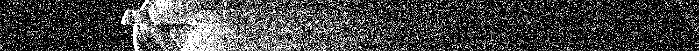

上图为第1行的SPAD仿真响应情况

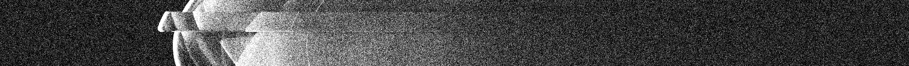

上图为第2行的SPAD仿真响应情况

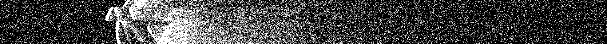

上图为第3行的SPAD仿真响应情况

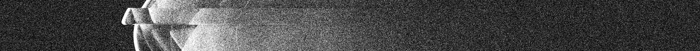

上图为第4行的SPAD仿真响应情况

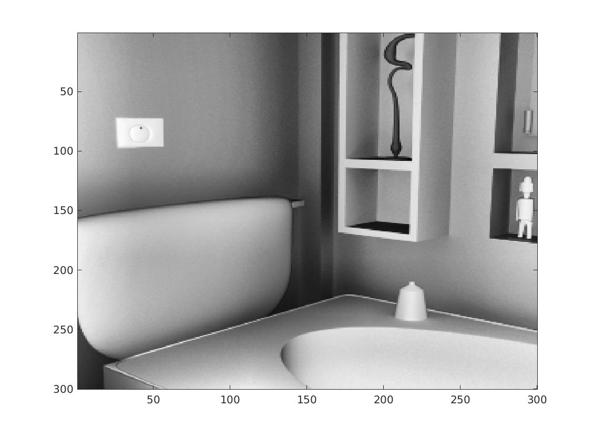

RGB_GT_结果

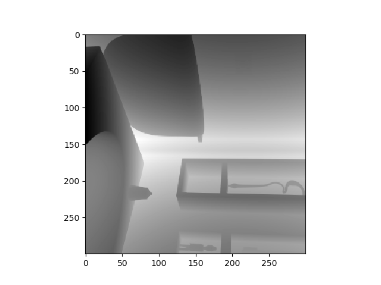

Depth_GT_结果

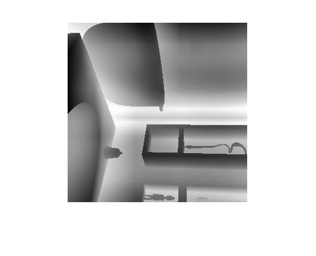

SPAD寻峰结果

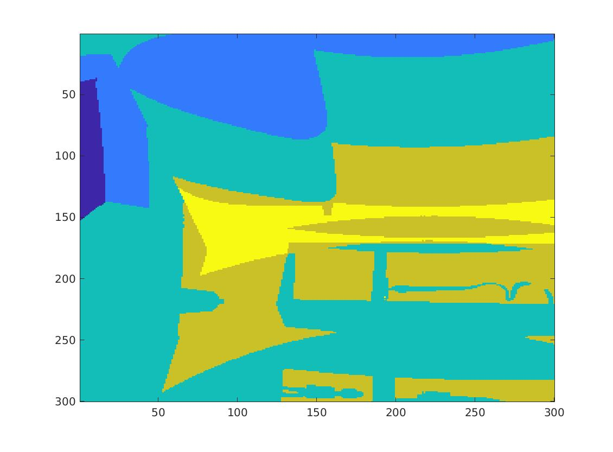

SPAD bin=100 寻峰结果

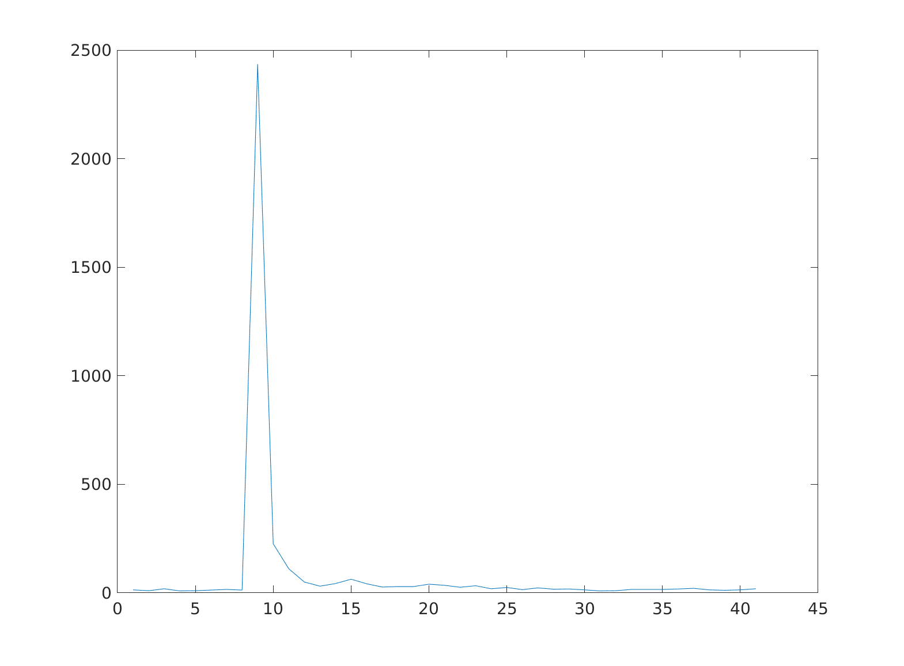

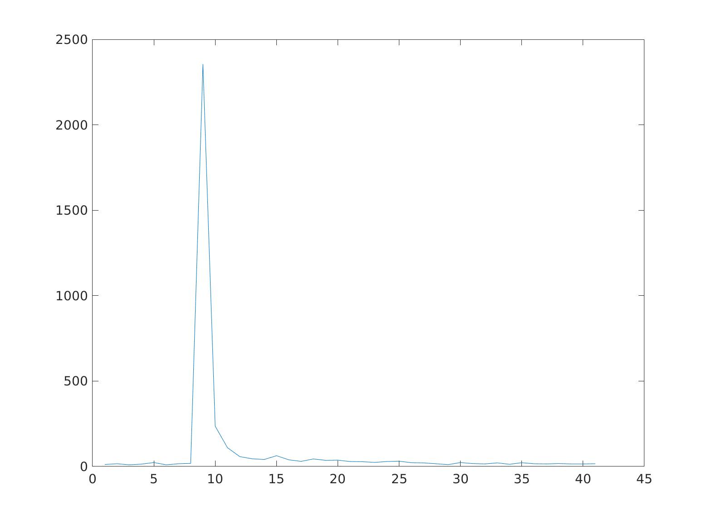

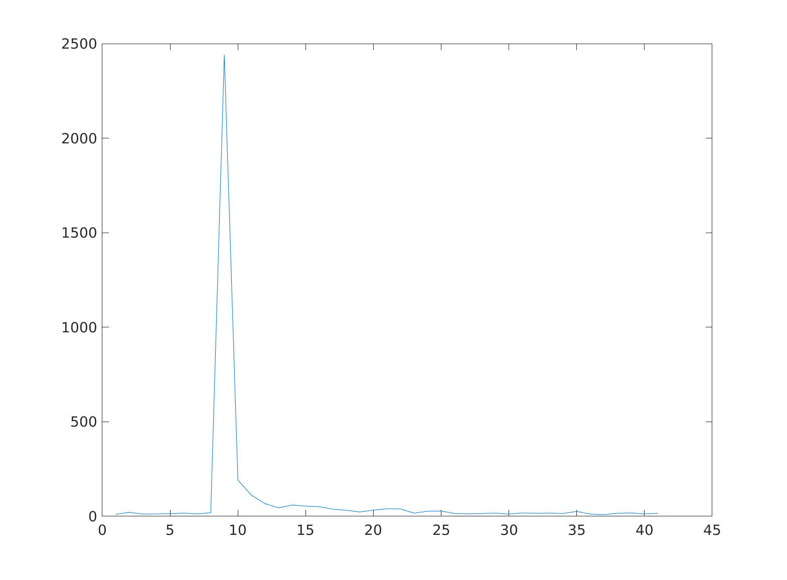

